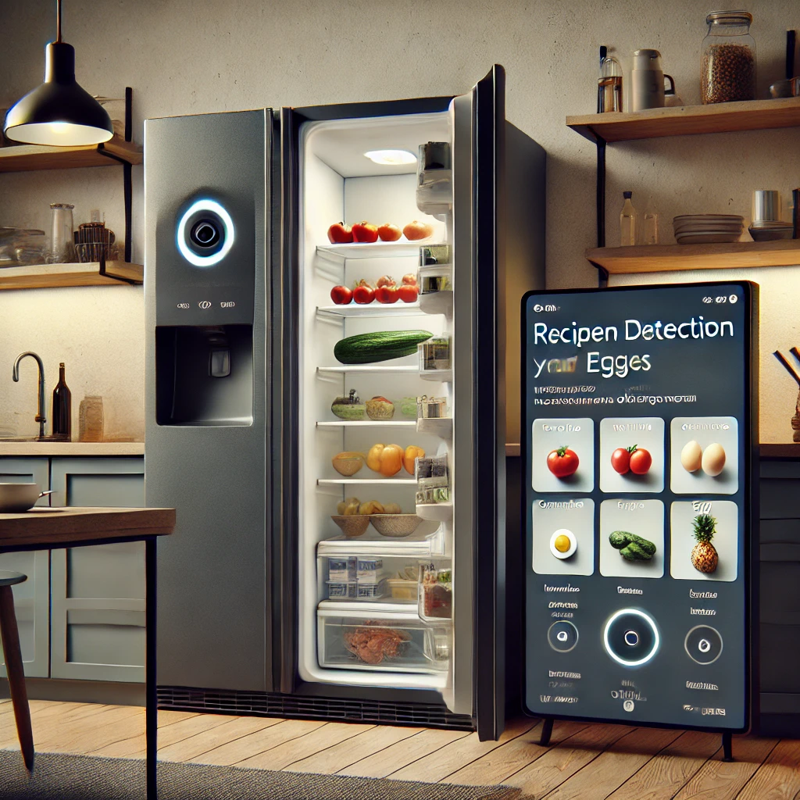

# Smart Fridge IoT Project with CNN and SLM

## Project Overview

This project focuses on building an IoT system for a **smart refrigerator** using a combination of **Convolutional Neural Networks (CNNs)** for image classification and **Small Language Models (SLMs)** for user interaction. The goal is to provide smart recipe suggestions and optimize ingredient usage based on real-time data from the fridge, ensuring user privacy and offline capabilities.

The system consists of two main components:
1. **Image Classification with CNN**: A camera inside the fridge captures images of the ingredients, and a CNN model is used to classify and detect the ingredients (e.g., tomatoes, cucumbers, eggs).
2. **Recipe Recommendations with SLM**: Based on the detected ingredients, a Small Language Model (SLM) provides personalized recipe suggestions and interacts with the user to guide meal preparation.

## Features

- **Ingredient Detection**: Automatically detect and classify ingredients using CNN from images captured inside the fridge.
- **Offline Recipe Recommendations**: An SLM suggests recipes locally based on the detected ingredients, ensuring user privacy by processing data on the device.
- **Smart User Interaction**: The SLM interacts with the user, offering recipe suggestions and allowing users to ask questions like, "What can I cook with tomatoes and spinach?"
- **IoT Integration**: The system runs on edge devices (e.g., an NVIDIA Jetson board) that connect to the fridge, providing a seamless, low-latency experience.

## Architecture

- **CNN for Ingredient Classification**:
  - Pre-trained CNN models (e.g., ResNet) are used to classify ingredients.
  - The model is fine-tuned to recognize various food items commonly found in a refrigerator.
  
- **SLM for Recipe Suggestions**:
  - A small language model provides recipe recommendations based on the ingredients detected by the CNN.
  - The SLM works offline to ensure data privacy and minimize reliance on cloud services.

- **IoT Edge Device**:
  - The project uses an IoT edge device (e.g., NVIDIA Jetson) to handle image processing and SLM inference locally within the smart fridge.
